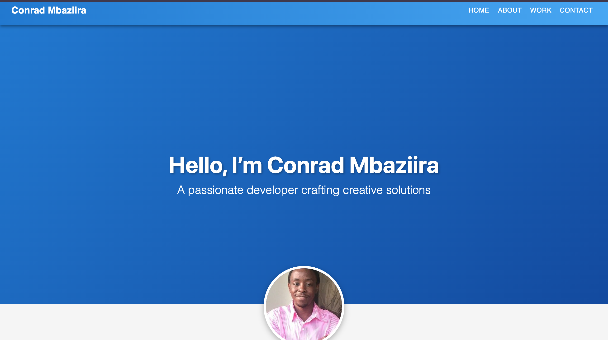

# Conrad Bugingo's Portfolio

A sleek, responsive portfolio website showcasing my skills and projects as a web developer. Built with React and Vite, it highlights my expertise in modern web development, including full-stack applications and WordPress CMS.

Features a clean design with Material-UI components, smooth animations, and a mobile-friendly layout.

---

## 🚀 Features

- **Responsive Design**: Optimized for desktop and mobile devices.
- **Project Showcase**: Displays main projects (Microloan Tracker, Crypto Trends) and more under a "View More" section.
- **Interactive UI**: Smooth navigation, copy-to-clipboard email feature, hover animations.
- **Professional Layout**: Clean typography, profile picture, organized sections (Home, About, Work, Contact).
- **Deployment**: Hosted on Vercel for fast and reliable performance.

---

## 🌐 Live Demo

[Visit My Portfolio](https://portfolio-ten-woad-k56z0i2k6x.vercel.app/)

---

## 🛠️ Technologies Used

- **Frontend**: React, Material-UI, CSS
- **Build Tool**: Vite
- **Deployment**: Vercel

---

## 📂 Projects

1. **Microloan Tracker**  
   [Live Demo](https://microloan-tracker.vercel.app/)  
   A full-stack app for tracking microloans using React and a backend server.

2. **Crypto Trends**  
   [Live Demo](https://crypto-trends-kohl.vercel.app/)  
   A full-stack app tracking cryptocurrency trends with real-time API data.

3. **EESC Luganda**  
   [Live Demo](https://eescluganda.wuaze.com/?i=1)  
   A WordPress site showcasing CMS development skills.

4. **Distance Calculator**  
   [Live Demo](https://distance-calculator-omega.vercel.app/)  
   A React app to calculate distances between addresses or coordinates using the OpenCage API and Haversine formula.

5. **Coming Soon** _(Placeholder)_  
   A new project in development.

6. **Coming Soon** _(Placeholder)_  
   A new project in development.

---

## ⚙️ Setup

### 1️⃣ Clone the Repository

```bash
git clone https://github.com/ConradPB/portfolio.git
cd portfolio
```

### 2️⃣ Install Dependencies

yarn install

### 3️⃣ Run Locally

yarn dev

### 4️⃣ Build for Production

yarn build

### 🚀 Deployment

To deploy on Vercel:

1. Install the Vercel CLI:

npm install -g vercel

2. Deploy:

vercel

3. Recommended Vercel Build Settings:

- **Build Command**: vite build

- **Output Directory**: dist

- **Framework Preset**: Vite

## 📸 Screenshots



## 🤝 Contributin

Feel free to submit issues or pull requests to improve the portfolio.

For feedback or collaboration, email me at cpbmbaz57@gmail.com.

## 📜 License

This project is licensed under the MIT License.

Built with ❤️ by Conrad Mbaziira
